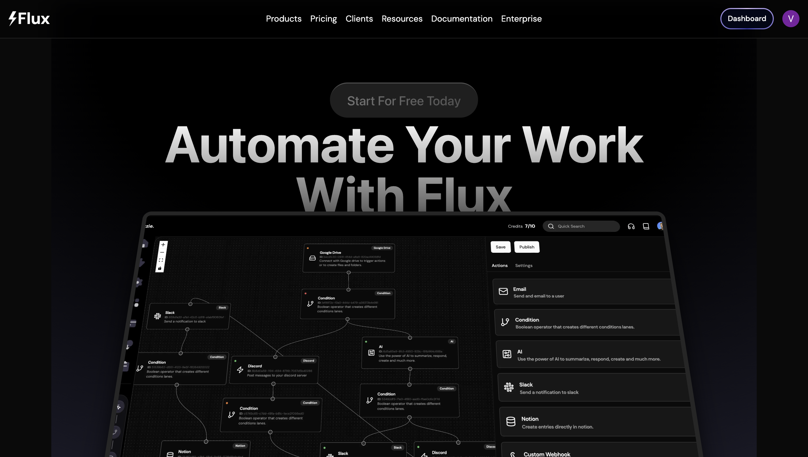

# Flux - Workflow Automation Saas App
#### Built With NextJs14 using Clerk Authentication, Neon Tech, Prisma, Uploadcare, Ngrok & Bun




### Features
-  Light & Dark mode
-  Intriguing & Functioning landing page
- User Authentication, Login / SignOut
- Build & manage Workflows
- Modern design workflow node editor
- Drap & drop functionality in Canvas
- Minimap 
- Resizable sidebar
- User can connect their Google Drive, Slack, Notion, Discord accounts
- Send messages to their Slack / Notion / Discord accounts via workflows
- Prisma ORM & Data persistence in Neon Tech 


### Setup Instructions
Run the following in terminal
```bash
git clone https://github.com/vansh2308/workflow-automation-builder.git
cd ./workflow-automation-builder
bun install 
```
Setup your .env file 
```
NEXT_PUBLIC_CLERK_SIGN_IN_URL=/sign-in
NEXT_PUBLIC_CLERK_SIGN_UP_URL=/sign-up
NEXT_PUBLIC_CLERK_AFTER_SIGN_IN_URL=/dashboard
NEXT_PUBLIC_CLERK_AFTER_SIGN_UP_URL=/dashboard

NEXT_PUBLIC_CLERK_PUBLISHABLE_KEY=
CLERK_SECRET_KEY=

DATABASE_URL=

NEXT_PUBLIC_URL=https://localhost:3000
NEXT_PUBLIC_DOMAIN=localhost:3000
NEXT_PUBLIC_SCHEME=https://

NEXT_PUBLIC_GOOGLE_SCOPES=https://www.googleapis.com/auth/drive
NEXT_PUBLIC_OAUTH2_ENDPOINT=https://accounts.google.com/o/oauth2/v2/auth

NEXT_PUBLIC_UPLOAD_CARE_CSS_SRC=https://cdn.jsdelivr.net/npm/@uploadcare/blocks@
NEXT_PUBLIC_UPLOAD_CARE_SRC_PACKAGE=/web/lr-file-uploader-regular.min.css

DISCORD_CLIENT_ID=
DISCORD_CLIENT_SECRET=
DISCORD_TOKEN=
DISCORD_PUBLICK_KEY=
NEXT_PUBLIC_DISCORD_REDIRECT=https://discord.com/oauth2/authorize?client_id=*CLIENTID*&response_type=code&redirect_uri=https%3A%2F%2Flocalhost%3A3000%2Fapi%2Fauth%2Fcallback%2Fdiscord&scope=identify+guilds+connections+guilds.members.read+email+webhook.incoming

NOTION_API_SECRET=
NOTION_CLIENT_ID=
NOTION_REDIRECT_URI=https://localhost:3000/api/auth/callback/notion
NEXT_PUBLIC_NOTION_AUTH_URL=https://api.notion.com/v1/oauth/authorize?client_id=*CLIENTID*&response_type=code&owner=user&redirect_uri=https%3A%2F%2Flocalhost%3A3000%2Fapi%2Fauth%2Fcallback%2Fnotion

# ,groups:read,mpim:read,im:read'

SLACK_SIGNING_SECRET=
SLACK_BOT_TOKEN=
SLACK_APP_TOKEN=
SLACK_CLIENT_ID=
SLACK_CLIENT_SECRET=
SLACK_REDIRECT_URI=https://localhost:3000/api/auth/callback/slack
NEXT_PUBLIC_SLACK_REDIRECT=https://slack.com/oauth/v2/authorize?client_id=*CLIENTID*&scope=chat:write,channels:read,groups:read,mpim:read,im:read&user_scope=chat:write,channels:read,groups:read,mpim:read,im:read&redirect_uri=https%3A%2F%2Flocalhost%3A3000%2Fapi%2Fauth%2Fcallback%2Fslack

GOOGLE_CLIENT_ID=
GOOGLE_CLIENT_SECRET=
OAUTH2_REDIRECT_URI=https://electric-grizzly-7.clerk.accounts.dev/v1/oauth_callback
NGROK_URI=
CRON_JOB_KEY=
STRIPE_SECRET=
```

Setup ngrok
```bash
brew install ngrok/ngrok/ngrok
ngrok config add-authtoken <TOKEN>
ngrok http http://localhost:8080
```

Open terminal and issue:
```bash
bun run dev
```

Voila ;) Just type in http://localhost:3000 in your browser!


### Author
- Github - [vansh2308](https://github.com/vansh2308)
- Website - [Vansh Agarwal](https://portfolio-website-self-xi.vercel.app/)
- Frontend Mentor - [@vansh2308](https://www.frontendmentor.io/profile/vansh2308)